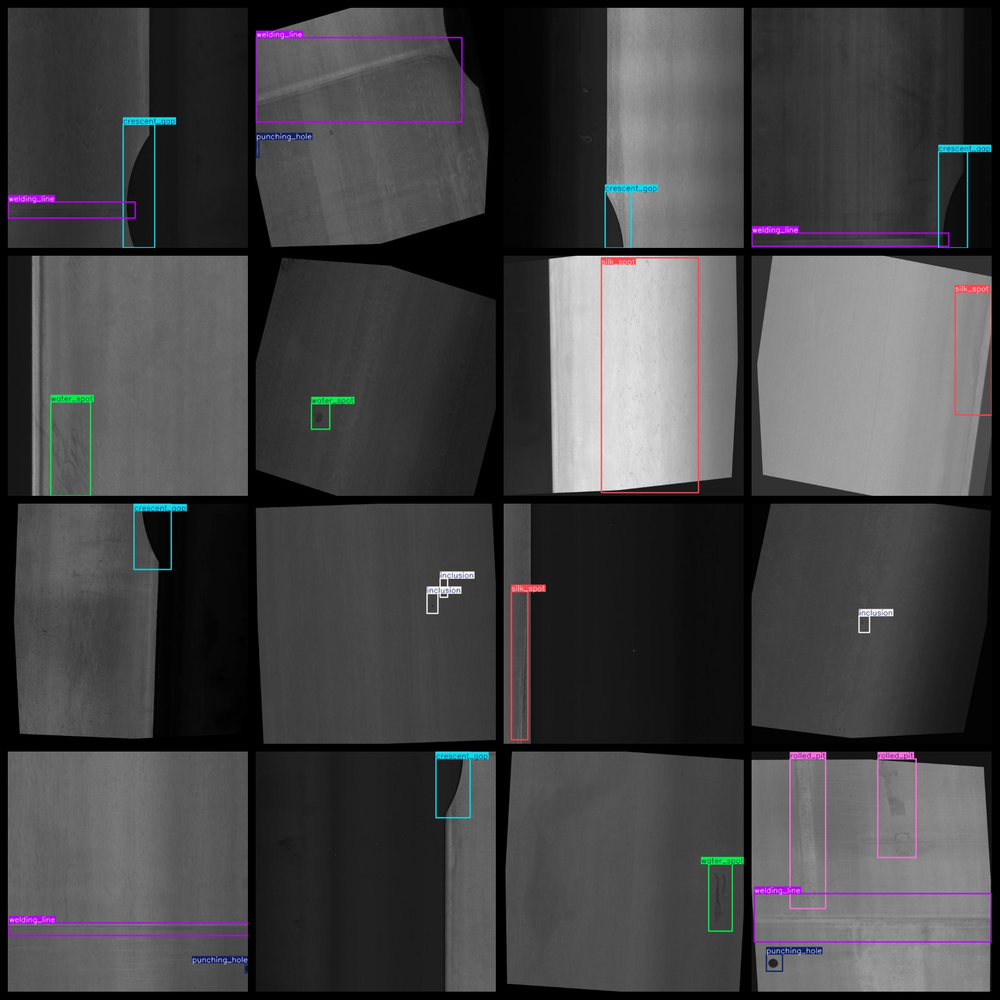
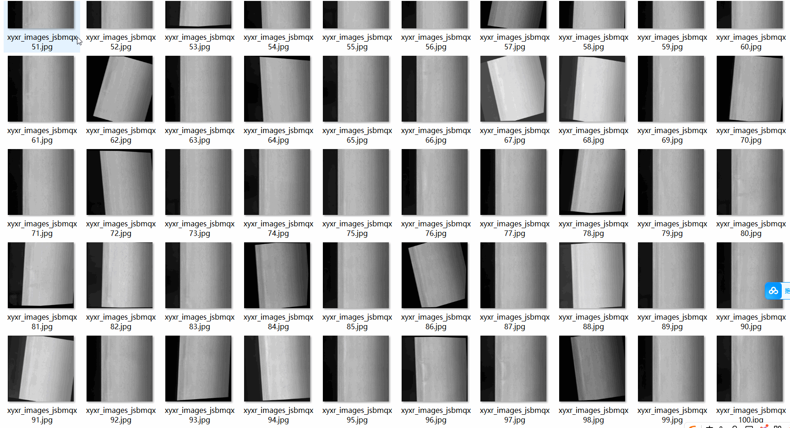

# [Object Detection] Metal Surface Defect Dataset 4108 images, YOLO+VOC format

【Object Detection】Metal Surface Defects Dataset: 4108 Images, Using YOLO+VOC Format

Dataset Format: Pascal VOC + YOLO (excluding the split-path txt file; only jpg images with corresponding VOC-format xml files and YOLO-format txt files)

There are a total of 4108 jpg images in the JPEGImages folder.

The total number of XML files in the Annotations folder is 4,108.

The total number of txt files in the labels folder is 4108.

Number of label types: 10

Tags: ["crease", "crescent_gap", "inclusion", "oil_spot", "punching_hole", "rolled_pit", "silk_spot", "waist folding", "water_spot", "welding_line"]

The number of boxes per label (Note that the order of classes in YOLO format may not match the 'labels' folder's 'classes.txt'):

Crease Frames = 124

The number of crescent-gap bars = 469 (new moon gap)

【】『』「」<>[]

Oil spot frame count = 997 (oil spots)

Punching_hole frame_number = 561 (punch hole)

Rolled pits = 136 (rolling pits)

Silk spot frame count = 1588 (silk spots)

Waist Folding Frame Count = 262 (Waist Folding)

Water_spot frame count = 650

Welding_line Frames = 925 (welds)

Total frame count: 6317

Picture clarity (Resolution: Pixels): Clear

Is the image enhanced: No

Shape of the label: Rectangular box, used for object detection and recognition.

Important note: No special statement is made at this time.

Special Disclaimer: This dataset does not guarantee the accuracy or precision of the training model or weight files, and only provides accurate and reasonable annotations.
## Images

---

Here is a pay link on Stripe (https://buy.stripe.com/3cs8yP7sY87d0vu9AB). Please contact me lonlonago@foxmail.com after funding $89, and I will send you a complete data files, thank you!

